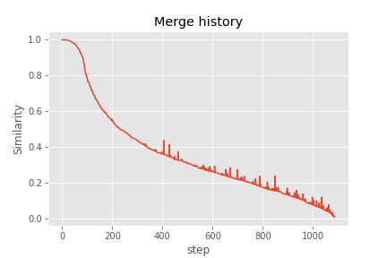

# HW4 Report

## Author 
B06705023 資管四 邱廷翔
## Environment
* python >= 3.6
* Linux >= 16.04

## Requirments
* nltk

To install the required libraries, run the following command.
```shell
pip install -r requirements.txt
```

## Executing the code
```bash
python main.py
```

* Before running the code, make sure the directory *IRTM* is present.

## Program descriptions

### I have implemented the efficient HAC! Please do check the code or view the following documentation.
The program can be broke into several phases.

1. Traverse the folder and generate normalized feature vector.
     1. Use *tokenization*, which is from HW1, to preprocess each line of the document for the whole document collection.
     2. Once we have the whole token set for each of the documents, we calculate the tfidf vector for each document.
     3. After calculating the tfidf vector, we normalize each of the value in the documnet set.

2. Priority queue definition, and helper class
   1. Firstly, I define a class *node*, to store the *similarity value*, and *index* for each possible pairs of document.
      ```python
       class node:
           similarity = 0
           index = i
       ```
    2. Secondly, the *p_queue* class for the priority queue.
        ```python
        class p_queue:
            def __init__(self):
               self.items = [0] * 2000
               self.list_size = 0
               self.name2position = {}
               self.position2name = {}
            # Some helper functions, the function purpose is self explanatory
            
            def __str__(self):
               return str(self.items)
            
            def _is_leaf(self, pos):
               if 2 * pos > self.list_size:
                  return True
               return False

            def _swap(self, first, second):
               self.items[first], self.items[second] = (self.items[second], self.items[first])
               first_name = self.position2name[first]
               second_name = self.position2name[second]
               self.position2name[first], self.position2name[second] = self.position2name[second], self.position2name[first]
               self.name2position[first_name], self.name2position[second_name] = self.name2position[second_name], self.name2position[first_name]
            
            def _remove_last(self):
               last_name = self.position2name[self.list_size]
               self.position2name.pop(self.list_size, None)
               self.name2position.pop(last_name, None)
               self.items[self.list_size] = 0
               self.list_size -= 1
            
            def insert(node):
                # Register the node information (similarity value, and index) into self.
                # Put the node in the last and heapify the list.
                pass
            def heapify(pos):
                # Given a *pos*, we sink the node to proper position.
                pass
            def pop_top():
                # save the element in top_item
                # Swap with the last element
                # re-heapify
                return top_item
            
            def pop(name):
                # pop out the given element name
                # Swap the element with the last of the element, and then re-heapify.
                
            def clear():
                # clear all the memory
                self.items = [0] * 2000
                self.name2position.clear()
                self.position2name.clear()
                self.list_size = 0

            def get_top():
                return self.items[1]

            def get_top_name(self):
                return self.position2name[1]
        ```
 1. Calculate the pairwise similarity and prepare and $n\cdot n$ priority queue.
    1. Pairwise similarity can be acquired by $S\cdot S^T$.
    2. For each document, which is a *p_queue* instance, insert *node*s by setting similarity and index.
       1. Passed on if the document is calculating self similarity.
    3. We will then acquire a list of *p_queue*s called *priority_queue*.
 2. Clustering phase
    1. There will be a total of 1095 - K rounds, K is the number of clusters.
    2. In each round, do the following.
       1. Pick out the maximum similarity, and its index *maximum_sim* by traversing all the instances in *priority_queue*.
       2. The pair would then be *maximum_sim*, and *priority_queue[maximum_sim].get_top_name()=k2*
       3. Set chooseable[k2] to *False*
       4. Merge the cluster with larger index into the one with smaller.
          1. Traverse the *priority_queue*, and remove the node indexed *maximum_sim*, and *k2* in each instance in *priority_queue* if chooseable.
          2. Recalculate the updated cluster similarity between (i, and *maximum_sim+k2*)
          3. Insert it into both i and *maximum_sim*.
    3. The distance measure used here is complete link clustering
 3. Retrieve the clustering results.
    1. Sort each clusters, so that it meets the spec.

## Clustering history


    
Since we are using a priority queue to store values, we can achieve insertion and deletion in $O(\log N)$. And the total model complexity would then be $O(N^2\log N)$.